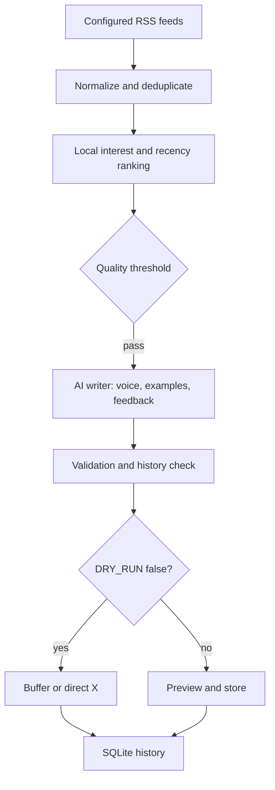

# Personal X News Bot

A lightweight Python service that collects RSS stories, ranks them locally against your interests, asks one AI model to write a short original post in your voice, validates it, and optionally publishes it. The default is **dry run**. A scheduled window may publish nothing when no story clears the quality threshold.

The `frontend/` directory contains a full-width editorial workspace built with Next.js, TypeScript, Tailwind CSS, and Lucide icons. It uses the existing FastAPI service for real articles, drafts, history, settings, and actions. No demonstration data is inserted into the database.



## Setup

Requires Python 3.12+. Create a virtual environment, install `requirements.txt`, copy `.env.example` to `.env`, and edit it locally. `.env` is ignored by Git.

```powershell
py -3.12 -m venv .venv
.\.venv\Scripts\python -m pip install -r requirements.txt
Copy-Item .env.example .env
.\.venv\Scripts\python manage.py dry-run
```

Run the API with `.\.venv\Scripts\python -m uvicorn app.main:app --host 127.0.0.1 --port 8000`. API docs are at `/docs`. Run the scheduler as a separate process with `.\.venv\Scripts\python -m app.scheduler`. Keep only one scheduler process. On a server, use a process manager for the API and scheduler, persistent storage for SQLite, and restrict the admin API to a trusted network; it has no login system.

In a second terminal, start the dashboard:

```powershell
cd frontend
npm ci
npm run dev
```

Open `http://127.0.0.1:3000`. The Next.js server proxies `/api/*` to FastAPI at `127.0.0.1:8000`. Run both servers on the same machine. For a production deployment, set the proxy destination in `frontend/next.config.ts` to the private address of the API, then run `npm run build` and `npm run start`. Put HTTPS and authentication in front of the dashboard and API before exposing either publicly. The app currently has no login.

## Editorial workspace

The main page has All content, Discover, Drafts, Calendar, By status, Published, and Archive views. Rows open a right-side inspector. Filter and sort controls change the current view; search works across titles, posts, sources, and topics and opens with Ctrl/Cmd+K. Discover fetches feeds without an AI call. Generate, regenerate, edit, skip, schedule, unschedule, feedback, and publish use FastAPI endpoints and SQLite. Failed actions display inline errors.

Settings → Voice edits `VOICE_PROFILE.md` and `data/style_examples.json`. Settings → Sources edits `config/sources.yaml`. Settings → Automation stores posting windows, timezone, minimum score, discovery, generation, approval, and pause state in SQLite. The scheduler reads these settings each minute. A scheduled post is explicit approval for that post; automatic generation at a window needs the separate “Publish without approval” switch. `DRY_RUN=true` overrides both and blocks publishing. The dashboard disables the Publish button while dry run is on, and the API enforces the same rule.

With no AI credential, discovery and all read, edit, settings, and feedback actions still work. Generation returns a clear API error. See the AI section below to configure a provider locally; never paste keys into the dashboard or commit `.env`.

## Tuning

- Add or disable feeds in `config/sources.yaml`. Each has a name, RSS URL, category, priority, and enabled flag.
- Adjust topic groups and keywords in `config/interests.yaml`. Ranking combines freshness, category match, keyword match, source priority, and a penalty for topics covered recently. It also removes URL and similar headline duplicates. `MIN_SCORE` controls the skip threshold.
- Edit `VOICE_PROFILE.md` to change tone and constraints. Add 10–50 entries to `data/style_examples.json`; only three examples with the most keyword overlap are supplied per generation.
- Rate a post with `python manage.py rate-post 123 like good_voice` or `POST /posts/123/feedback`. Recent feedback enters the writing prompt. Current ranking uses post history; feedback does not yet automatically change numeric ranking weights.

The model receives feed headline, short description, source, publication date, URL and category. It does not scrape full articles. The writer chooses among reaction, explanation, builder perspective, question, and straightforward. It returns a structured post, style, confidence, and factual claims. Validation checks length, URL presence, repeated post text and article use, low confidence, excessive hashtags or emoji, personal experience claims, and numbers absent from the feed text. These are conservative heuristics, **not proof that every claim is true**. Review previews before enabling automatic publication.

## AI and publishing

For a no-cost start, use the default `AI_PROVIDER=gemini` with `AI_MODEL=gemini-2.5-flash-lite` and a free-tier `GEMINI_API_KEY` from [Google AI Studio](https://aistudio.google.com/apikey). Check [current pricing](https://ai.google.dev/gemini-api/docs/pricing) and your [account's rate limits](https://ai.google.dev/gemini-api/docs/rate-limits); free-tier requests are limited and Google says free-tier content may be used to improve its products. Do not link a paid billing tier if you require a strict zero-cost setup. The existing `xai` and `openai` providers remain optional; set `AI_PROVIDER` and `AI_MODEL` to switch. Without the selected provider's key, the live run collects and ranks news, then records a generation failure. No key is needed for tests.

`PUBLISHER=buffer` uses Buffer's GraphQL API, a personal API key, and the ID of your connected X channel (`BUFFER_CHANNEL_ID`). Buffer's `shareNow` accepts the post but delivery may be asynchronous, so the database uses `queued` until delivery is independently confirmed. `PUBLISHER=direct_x` uses X API v2 with OAuth 1.0a user credentials. Confirm your X app has posting access. `DRY_RUN=true` blocks both publishers, including manual `POST /publish/{post_id}`. Set it to `false` only after previewing output and configuring credentials. The custom idea endpoint generates and stores a draft; it never publishes automatically.

API routes: `GET /health`, `/articles`, `/posts`, `/runs`, `/stats`, `/workspace`, `/settings/{voice|sources|automation}`; `POST /pipeline/run`, `/pipeline/dry-run`, `/pipeline/discover`, `/generate/{article_id}`, `/generate/custom`, `/posts/{id}/feedback`, `/posts/{id}/{schedule|unschedule|regenerate}`, `/publish/{post_id}`; `PATCH /articles/{id}`, `/posts/{id}`; `PUT /settings/{voice|sources|automation}`.

## Cost and operation

Feeds, ranking, deduplication, and storage are local and free. A normal window makes at most one generation call, so 60–90 posts per month imply roughly 60–90 calls, plus manual generations and failures. AI cost depends on your chosen model and token use. Set `INPUT_COST_PER_MILLION` and `OUTPUT_COST_PER_MILLION` to record an estimate; otherwise the cost field remains blank. Buffer and X plan costs and limits depend on your account, so check current provider pricing before enabling publication. The service tracks AI calls, tokens, generated posts, queued posts, and confirmed direct X posts at `/stats`.

Run tests: `.\.venv\Scripts\python -m pytest -q`. Tests never call a live publisher. In `frontend/`, run `npm run lint`, `npm run typecheck`, and `npm run build`.

Official API references: [Gemini structured output](https://ai.google.dev/gemini-api/docs/generate-content/structured-output), [OpenAI Responses](https://platform.openai.com/docs/api-reference/responses), [xAI Responses](https://docs.x.ai/developers/rest-api-reference/inference/responses), [Buffer create post](https://developers.buffer.com/examples/create-text-post.html), [Buffer scheduling](https://developers.buffer.com/guides/posts-and-scheduling.html), [X API](https://docs.x.com/x-api/posts/manage-tweets/introduction).
