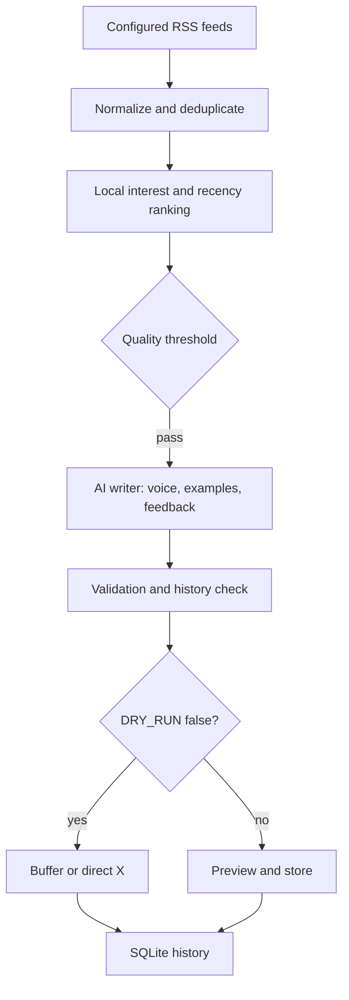

# Personal X News Bot

A lightweight Python service that collects RSS stories, ranks them locally against your interests, asks one AI model to write a short original post in your voice, validates it, and optionally publishes it. The default is **dry run**. A scheduled window may publish nothing when no story clears the quality threshold.



## Setup

Requires Python 3.12+. Create a virtual environment, install `requirements.txt`, copy `.env.example` to `.env`, and edit it locally. `.env` is ignored by Git.

```powershell
py -3.12 -m venv .venv
.\.venv\Scripts\python -m pip install -r requirements.txt
Copy-Item .env.example .env
.\.venv\Scripts\python manage.py dry-run
```

Run the API with `.\.venv\Scripts\python -m uvicorn app.main:app --host 127.0.0.1 --port 8000`. API docs are at `/docs`. Run the scheduler as a separate process with `.\.venv\Scripts\python -m app.scheduler`. Keep only one scheduler process. On a server, use a process manager for the API and scheduler, persistent storage for SQLite, and restrict the admin API to a trusted network; it has no login system.

## Tuning

- Add or disable feeds in `config/sources.yaml`. Each has a name, RSS URL, category, priority, and enabled flag.
- Adjust topic groups and keywords in `config/interests.yaml`. Ranking combines freshness, category match, keyword match, source priority, and a penalty for topics covered recently. It also removes URL and similar headline duplicates. `MIN_SCORE` controls the skip threshold.
- Edit `VOICE_PROFILE.md` to change tone and constraints. Add 10–50 entries to `data/style_examples.json`; only three examples with the most keyword overlap are supplied per generation.
- Rate a post with `python manage.py rate-post 123 like good_voice` or `POST /posts/123/feedback`. Recent feedback enters the writing prompt. Current ranking uses post history; feedback does not yet automatically change numeric ranking weights.

The model receives feed headline, short description, source, publication date, URL and category. It does not scrape full articles. The writer chooses among reaction, explanation, builder perspective, question, and straightforward. It returns a structured post, style, confidence, and factual claims. Validation checks length, URL presence, repeated post text and article use, low confidence, excessive hashtags or emoji, personal experience claims, and numbers absent from the feed text. These are conservative heuristics, **not proof that every claim is true**. Review previews before enabling automatic publication.

## AI and publishing

Set `AI_PROVIDER=xai` or `openai`, `AI_MODEL` to a model your account can use, and the corresponding API key in `.env`. Without a key, the live run collects and ranks news, then records a generation failure. No key is needed for tests.

`PUBLISHER=buffer` uses Buffer's GraphQL API, a personal API key, and the ID of your connected X channel (`BUFFER_CHANNEL_ID`). Buffer's `shareNow` accepts the post but delivery may be asynchronous, so the database uses `queued` until delivery is independently confirmed. `PUBLISHER=direct_x` uses X API v2 with OAuth 1.0a user credentials. Confirm your X app has posting access. `DRY_RUN=true` blocks both publishers, including manual `POST /publish/{post_id}`. Set it to `false` only after previewing output and configuring credentials. The custom idea endpoint generates and stores a draft; it never publishes automatically.

API routes: `GET /health`, `/articles`, `/posts`, `/runs`, `/stats`; `POST /pipeline/run`, `/pipeline/dry-run`, `/generate/{article_id}`, `/generate/custom`, `/posts/{id}/feedback`, `/publish/{post_id}`.

## Cost and operation

Feeds, ranking, deduplication, and storage are local and free. A normal window makes at most one generation call, so 60–90 posts per month imply roughly 60–90 calls, plus manual generations and failures. AI cost depends on your chosen model and token use. Set `INPUT_COST_PER_MILLION` and `OUTPUT_COST_PER_MILLION` to record an estimate; otherwise the cost field remains blank. Buffer and X plan costs and limits depend on your account, so check current provider pricing before enabling publication. The service tracks AI calls, tokens, generated posts, queued posts, and confirmed direct X posts at `/stats`.

Run tests: `.\.venv\Scripts\python -m pytest -q`. Tests never call a live publisher.

Official API references: [OpenAI Responses](https://platform.openai.com/docs/api-reference/responses), [xAI Responses](https://docs.x.ai/developers/rest-api-reference/inference/responses), [Buffer create post](https://developers.buffer.com/examples/create-text-post.html), [Buffer scheduling](https://developers.buffer.com/guides/posts-and-scheduling.html), [X API](https://docs.x.com/x-api/posts/manage-tweets/introduction).
